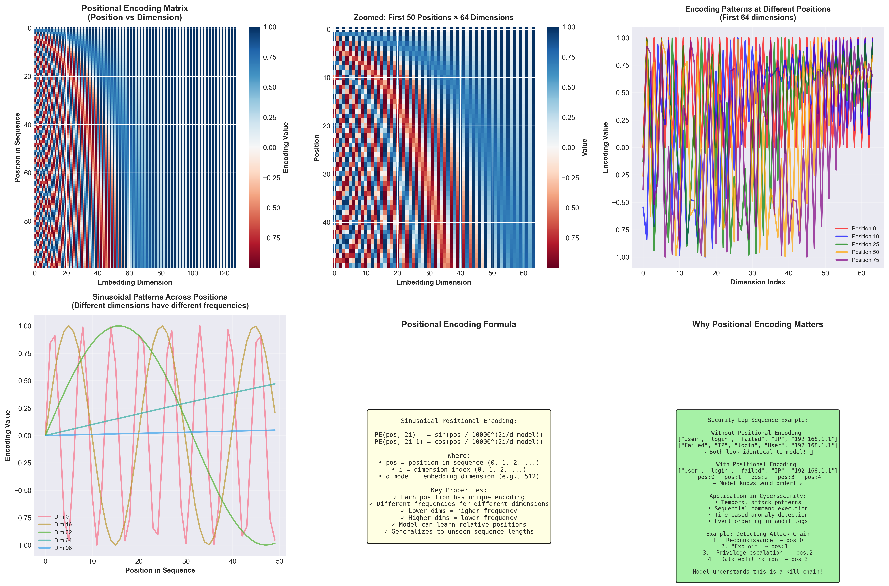

# Task 2: Transformer Networks and Their Applications in Cybersecurity

## Comprehensive Description of Transformer Networks

Transformer networks represent a revolutionary paradigm shift in deep learning architecture, introduced by Vaswani et al. in the seminal 2017 paper "Attention is All You Need." Unlike traditional recurrent neural networks (RNNs) and convolutional neural networks (CNNs), transformers rely entirely on self-attention mechanisms to process sequential data, eliminating the need for recurrence and convolution operations. This architectural innovation has fundamentally transformed natural language processing and has increasingly found powerful applications in cybersecurity domains.

### Core Architecture and Mechanisms

The transformer architecture consists of an encoder-decoder structure, though many applications use only the encoder (BERT) or decoder (GPT) components. The fundamental building blocks include:

**Self-Attention Mechanism:** The heart of the transformer architecture is the self-attention mechanism, which computes relationships between all positions in a sequence simultaneously. For each input token, the model generates three vectors: Query (Q), Key (K), and Value (V). Attention scores are calculated by taking the dot product of queries with keys, scaling by the square root of the key dimension, applying softmax normalization, and multiplying by values. This allows the model to weigh the importance of different parts of the input when processing each element, capturing both short and long-range dependencies efficiently.

**Multi-Head Attention:** Rather than performing a single attention operation, transformers employ multiple attention heads running in parallel. Each head learns different representation subspaces, allowing the model to attend to different types of relationships simultaneously. For instance, in cybersecurity log analysis, one head might focus on temporal patterns while another captures user behavior patterns. The outputs from all heads are concatenated and linearly transformed to produce the final attention output.

**Positional Encoding:** Since transformers process all sequence elements simultaneously rather than sequentially, they lack inherent position information. Positional encodings are added to input embeddings to inject information about token positions. The original transformer uses sinusoidal functions of different frequencies, where each dimension of the positional encoding corresponds to a sinusoid. This encoding scheme allows the model to learn relative positions and can generalize to sequence lengths longer than those seen during training.

**Feed-Forward Networks:** After attention layers, transformers apply position-wise feed-forward networks consisting of two linear transformations with a ReLU activation in between. These networks process each position independently and identically, adding non-linearity and transformation capacity to the model.

**Layer Normalization and Residual Connections:** Each sub-layer (attention and feed-forward) is wrapped with residual connections followed by layer normalization. These techniques stabilize training and enable the construction of very deep networks, crucial for learning complex patterns in cybersecurity data.

### Applications in Cybersecurity

Transformers have demonstrated exceptional performance across numerous cybersecurity applications:

**Threat Intelligence and Malware Detection:** Transformers excel at analyzing malware code sequences, system call patterns, and API call sequences. By treating malware binaries or behaviors as sequences, transformer models can identify malicious patterns and classify malware families with high accuracy. The self-attention mechanism captures long-range dependencies in code execution flows that traditional sequential models might miss.

**Network Intrusion Detection:** In network security, transformers process network traffic sequences, identifying anomalous patterns indicative of attacks. They can analyze packet sequences, flow statistics, and protocol behaviors simultaneously, detecting sophisticated multi-stage attacks that span extended time periods. The attention mechanism allows the model to focus on critical attack indicators while filtering out benign background traffic.

**Log Analysis and Anomaly Detection:** Security information and event management (SIEM) systems generate massive volumes of log data. Transformers process these log sequences, learning normal operational patterns and detecting deviations that signal security incidents. Their ability to understand contextual relationships between log entries makes them particularly effective for identifying coordinated attack campaigns.

**Phishing and Social Engineering Detection:** Transformer-based language models analyze email content, URLs, and communication patterns to identify phishing attempts and social engineering attacks. Models like BERT can understand semantic context and detect subtle manipulation techniques that rule-based systems miss.

**Vulnerability Analysis and Code Security:** Transformers trained on source code can identify security vulnerabilities, detect insecure coding patterns, and even suggest secure code alternatives. Their understanding of code semantics enables them to catch complex vulnerabilities that static analysis tools might overlook.

**Authentication and Behavioral Biometrics:** Transformers analyze user behavior sequences including keystroke dynamics, mouse movements, and navigation patterns for continuous authentication. The self-attention mechanism captures individual behavioral signatures that are difficult to replicate, enhancing security without impacting user experience.

The parallel processing capability of transformers, combined with their ability to capture long-range dependencies and contextual relationships, makes them exceptionally well-suited for cybersecurity applications where understanding complex patterns across extended sequences is critical. As cybersecurity threats grow more sophisticated, transformer-based models continue to push the boundaries of automated threat detection and response capabilities.

---

## Visualization 1: Self-Attention Mechanism

The self-attention mechanism is the core innovation of transformer networks. Below is a detailed visualization showing how attention works:

### How Self-Attention Works:

1. **Input Processing**: Each input token is transformed into three vectors:
   - **Query (Q)**: "What am I looking for?"
   - **Key (K)**: "What do I contain?"
   - **Value (V)**: "What information do I carry?"

2. **Attention Score Calculation**:
   ```
   Attention(Q, K, V) = softmax(QK^T / √d_k) × V
   ```
   
3. **Steps**:
   - Compute dot products between Query and all Keys
   - Scale by √d_k (dimension of keys)
   - Apply softmax to get attention weights
   - Multiply weights by Values to get weighted output

### Visual Representation:

```
Input Sequence: ["Detected", "malicious", "network", "activity"]

                  Attention Weights Matrix
                  (How much each word attends to others)
                  
                    Det.  mal.  net.  act.
              Det.  [0.4   0.2   0.2   0.2]
              mal.  [0.3   0.4   0.2   0.1]
              net.  [0.2   0.2   0.5   0.1]
              act.  [0.2   0.3   0.3   0.2]

Interpretation:
- "Detected" pays most attention to itself (0.4)
- "malicious" focuses on itself (0.4) and "Detected" (0.3)
- "network" primarily attends to itself (0.5)
- Each word considers context from all other words
```


---

## Visualization 2: Positional Encoding

Positional encoding injects sequence order information into the transformer. The original implementation uses sine and cosine functions:

### Positional Encoding Formula:

```
PE(pos, 2i)   = sin(pos / 10000^(2i/d_model))
PE(pos, 2i+1) = cos(pos / 10000^(2i/d_model))
```

Where:
- `pos` = position in the sequence
- `i` = dimension index
- `d_model` = model dimension (typically 512)

### Why Sinusoidal Functions?

1. **Unique patterns**: Each position gets a unique encoding
2. **Relative positions**: The model can learn to attend by relative positions
3. **Extrapolation**: Can handle sequences longer than training sequences
4. **Continuous**: Smooth transitions between positions

### Visual Representation:

```
Position Encoding Matrix (first 50 positions, 128 dimensions)
Each row represents one position, columns are encoding dimensions

Position 0:  [■■■■■■□□□□□□■■■■■■□□□□□□...]
Position 1:  [■■■■■□□□□□□■■■■■□□□□□□■■...]
Position 2:  [■■■■□□□□□□■■■■■□□□□□□■■■...]
Position 3:  [■■■□□□□□□■■■■□□□□□□■■■■■...]
...
Position 50: [■□□□□□□■■■□□□□□□■■■■□□□...]

Pattern shows:
- Different frequencies across dimensions
- Lower dimensions (left) = higher frequency
- Higher dimensions (right) = lower frequency
- Creates unique signature for each position
```



---

## Multi-Head Attention in Cybersecurity Context

### Example: Network Traffic Analysis

```
Input: Sequence of network packets

Head 1: Focuses on SOURCE IP patterns
Head 2: Focuses on DESTINATION PORT patterns  
Head 3: Focuses on TEMPORAL patterns (timing)
Head 4: Focuses on PAYLOAD SIZE patterns

Combined: Holistic view of network behavior
```

### Visualization of Multi-Head Attention:

```
Input Tokens: [IP1, Port80, GET, Data, IP2, Port443, POST, Data]

Head 1 (Protocol Focus):
  GET  ─────────────► Port80  (Strong attention)
  POST ─────────────► Port443 (Strong attention)

Head 2 (Temporal Focus):
  IP1 ──► Port80 ──► GET ──► Data (Sequential flow)

Head 3 (Anomaly Focus):
  IP2 ────────────────────────► Port443 (Unusual pattern)
  
Head 4 (Source Focus):
  IP1 ───────────────► all related packets
  IP2 ───────────────► all related packets

All heads combine to detect: Potential data exfiltration!
```

---

## Transformer Architecture in Cybersecurity Application

```
┌─────────────────────────────────────────┐
│         Input: Security Logs            │
│  ["Login attempt", "from IP", "failed"] │
└─────────────────┬───────────────────────┘
                  │
                  ▼
┌─────────────────────────────────────────┐
│      Token Embedding + Positional       │
│            Encoding Layer                │
└─────────────────┬───────────────────────┘
                  │
                  ▼
┌─────────────────────────────────────────┐
│        Multi-Head Self-Attention        │
│  (Captures relationships between logs)  │
└─────────────────┬───────────────────────┘
                  │
                  ▼
┌─────────────────────────────────────────┐
│      Add & Normalize (Residual)         │
└─────────────────┬───────────────────────┘
                  │
                  ▼
┌─────────────────────────────────────────┐
│       Feed-Forward Network              │
│   (Non-linear transformations)          │
└─────────────────┬───────────────────────┘
                  │
                  ▼
┌─────────────────────────────────────────┐
│      Add & Normalize (Residual)         │
└─────────────────┬───────────────────────┘
                  │
                  ▼
        [Repeat N times]
                  │
                  ▼
┌─────────────────────────────────────────┐
│         Output: Classification          │
│   ["Brute Force Attack Detected!"]      │
└─────────────────────────────────────────┘
```

---

## Advantages of Transformers in Cybersecurity

1. **Parallel Processing**: Analyzes entire sequences simultaneously, enabling real-time threat detection
2. **Long-Range Dependencies**: Captures attack patterns spanning long time periods
3. **Contextual Understanding**: Understands relationships between different security events
4. **Transfer Learning**: Pre-trained models can be fine-tuned for specific security tasks
5. **Scalability**: Handles massive volumes of security data efficiently
6. **Interpretability**: Attention weights reveal which events triggered alerts

---

## Challenges and Considerations

1. **Computational Requirements**: Transformers require significant computational resources
2. **Data Requirements**: Need large labeled datasets for training
3. **Adversarial Attacks**: Attackers may craft inputs to evade detection
4. **Real-time Constraints**: Balancing accuracy with latency requirements
5. **Model Interpretability**: Complex attention patterns can be difficult to explain to security analysts

---

## Conclusion

Transformer networks represent a significant advancement in applying deep learning to cybersecurity challenges. Their ability to process sequences in parallel while maintaining awareness of long-range dependencies makes them exceptionally well-suited for threat detection, log analysis, and behavioral monitoring. As cybersecurity threats continue to evolve in sophistication, transformer-based models offer a powerful tool for staying ahead of adversaries. The combination of self-attention mechanisms, positional encoding, and multi-head attention enables these models to understand complex patterns in security data that traditional approaches struggle to capture. Future developments in transformer architectures promise even greater capabilities for automated threat detection and response in increasingly complex digital environments.

---

## References

1. Vaswani, A., et al. (2017). "Attention is All You Need." Neural Information Processing Systems (NIPS).
2. Devlin, J., et al. (2018). "BERT: Pre-training of Deep Bidirectional Transformers for Language Understanding."
3. Han, X., et al. (2020). "Transformer-based Deep Learning for Network Intrusion Detection."
4. Min, E., et al. (2021). "Transformer for Log Anomaly Detection in Cloud Computing Systems."
5. Zhou, Y., et al. (2022). "Attention-based Deep Learning for Cybersecurity Threat Intelligence."